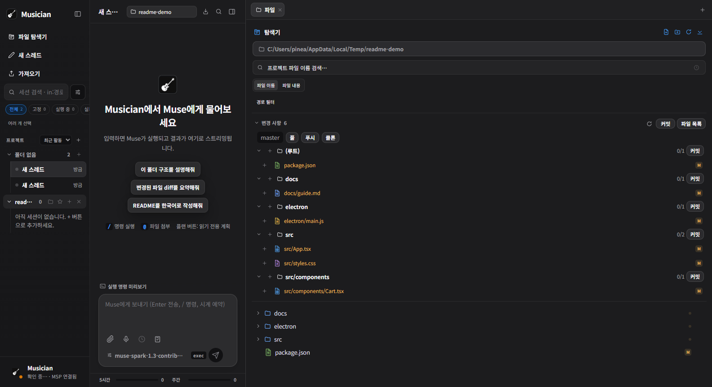
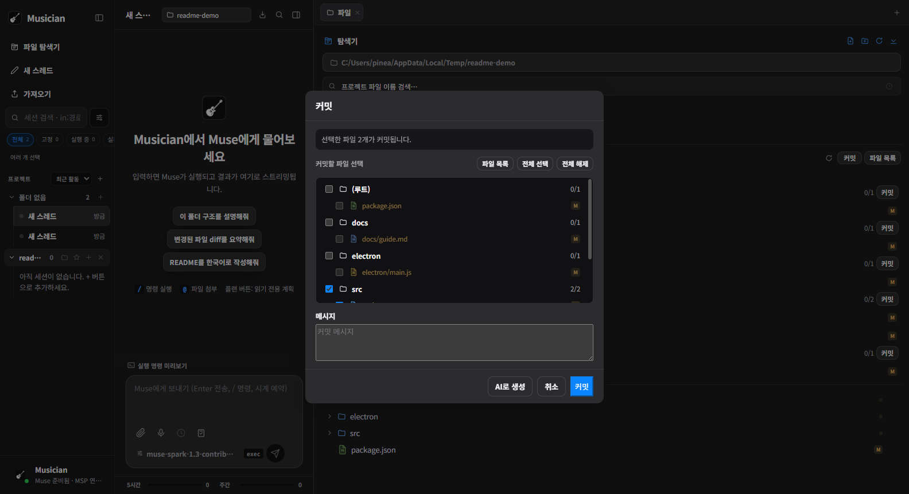
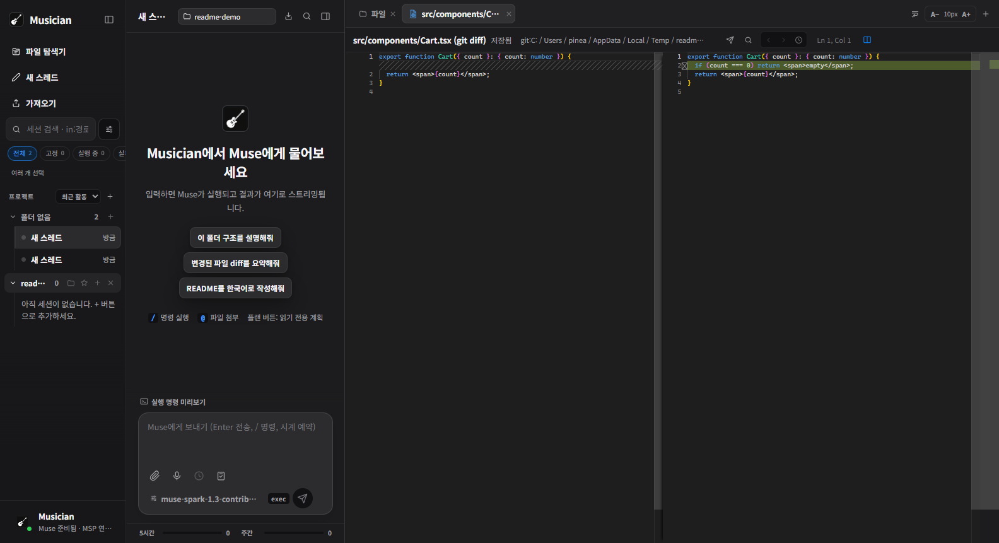

# 🎸 Musician

Muse Code CLI 전용 데스크톱 앱. 채팅은 CLI 그대로, 설정은 UI로.

<p>
  
  
  
  
  
  
  
  
</p>

- **엔진**: `React → @muse-code/sdk → MSP → muse serve`, 실패하면 `muse exec`로 자동 폴백
- **요금**: CLI 로그인/구독 그대로 사용. API 키 입력 없음, 추가 비용 없음

## 스크린샷

**변경 사항 디렉토리 묶음** — 디렉토리별 그룹 + 그룹 단위 스테이지/커밋:



**디렉토리 단위 커밋 선택** — 그룹의 커밋 버튼을 누르면 해당 디렉토리만 체크된 채 다이얼로그가 열림:



**Monaco diff 뷰** — 변경 행을 클릭하면 양쪽 비교 탭이 열림:



## 기술 스택

| 영역 | 스택 |
| --- | --- |
| 데스크톱 셸 | Electron 44 (electron-builder portable) |
| UI | React 19 + TypeScript 7, Vite 8 빌드 |
| 에디터 / diff | Monaco Editor, @monaco-editor/react |
| 터미널 | xterm.js (+ fit 애드온) |
| AI 엔진 | @muse-code/sdk → MSP → `muse serve`, `muse exec` 폴백 |
| 채팅 렌더링 | react-markdown + remark-gfm |
| 테스트 | Node 내장 테스트 러너 (unit) + Electron CDP 실앱 E2E |

## 배포 (사용자용)

- **요구 사항**: Windows 10/11 64비트, Muse Code CLI 설치 및 로그인 (`muse` 명령이 동작해야 함)
- **실행**: 받은 `Musician.exe`를 원하는 폴더에 두고 더블클릭. 설치 과정 없음, 중복 실행 시 기존 창이 앞으로 옴
- **첫 연결 확인**: 설정 → CLI 테스트에서 `msp` 또는 `exec` 엔진이 잡히면 정상
- **데이터 위치**: 설정·세션·로그는 `%APPDATA%\Mudex`에 저장됨 (exe를 옮기거나 교체해도 유지)
- **업데이트**: 앱을 완전히 종료한 뒤 새 `Musician.exe`로 덮어쓰기
- **브라우저 조종 (선택)**: 설정 → 브라우저 → 에이전트 조종 + MCP 등록. 외부 전송 없음 (127.0.0.1 브리지, 실행마다 새 토큰)

## 기능

- 스레드 채팅 (세션 유지, 작업 중 실시간 도구/파일 표시, 시간초과 이어서 계속, 실패 프롬프트 다시 입력, 메시지 시간 표시)
- 프롬프트 예약 (입력창 시계 버튼으로 예약, 1회·매일·매주·매월 반복, 지정 시간에 해당 스레드에서 자동 실행, 백그라운드 OS 알림, 팔레트에서 관리·편집·지금 실행·취소)
- 슬래시 명령 (입력 시작 `/new`·`/model`·`/usage`·`/settings`·`/shortcuts`·`/schedule`·`/export`·`/diff`·`/terminal`, Codex식 자동완성)
- 스레드 고정 (프로젝트·상태 그룹 내 상단 정렬, 앱 재시작 후 유지)
- 스레드 보관함 (목록에서 숨기기, 언제든 복원; 영구 삭제 전 확인)
- 스레드 복제 (팔레트에서 대화·제목 그대로 복사본 생성 후 이동)
- 대화 Markdown 내보내기 (프로젝트 경로와 변경 파일 정보 포함)
- 승인 패널 (허용/거부, 범위 선택)
- CLI 세션 목록 + 이어하기
- 모델/권한/추론 수준 팝오버 (Codex식)
- 파일 첨부 (파일 드래그 앤 드롭, 클립보드 이미지 붙여넣기, 이미지 미리보기) + 음성 입력
- 변경 사항 디렉토리 묶음 (디렉토리별 그룹, 그룹 단위 스테이지/커밋, 접기/펼치기) + 변경 파일 카드 (+/- 줄 수, 리뷰, 실행 취소)
- 커밋 다이얼로그 (디렉토리 묶음 기본, AI 커밋 메시지 생성)
- 검증 칩 (package.json의 typecheck/build/test/lint 실행)
- 파일(line N) 링크 → 에디터 줄 이동
- 사용량: 구독 할당량(5시간/주간) + 토큰 집계
- 에디터 (Monaco, diff, 변경 사항 패널)
- 편집기 편의 기능 (파일 경로 표시·클릭 복사, 줄/열 표시와 클릭 이동, `줄:열` 이동, 줄바꿈, 글자 크기 조절)
- 파일 탐색기 (파일 유형별 아이콘, 생성·이름 변경·삭제, 경로 복사, 변경 파일 목록, 이름·내용 검색 및 일치 줄로 이동, `Ctrl+P` 빠른 파일 검색·최근 파일)
- 재실행 시 선택된 스레드와 오른쪽 패널 탭 복원 (파일은 현재 디스크 내용으로 다시 열림)
- 다크 전용 Apple 스타일 UI, 영역 크기 조절
- 오른쪽 멀티탭 (코드·브라우저·터미널·파일·스킬, + 버튼으로 추가)
- CLI 스킬 탭 (필요한 스킬을 말하면 GitHub 검색 → 목록에서 선택 추가, 설치된 스킬 켜기/끄기/삭제, 폴더에서 설치)
- 브라우저 탭 (사용자 탐색 + 에이전트 공용 조종: 이동·클릭·입력·캡처) — 주소창 검색어 입력 시 웹검색, 홈 버튼, 북마크(별 토글·팔레트 점프), 연속 이동 시 중단 토스트 숨김, 팔레트·다이얼로그가 열리면 웹뷰 자동 숨김
- 에이전트 브라우저 MCP 서버 (`browser-mcp/server.js`, stdio)
- 프로젝트 그룹에서 폴더 추가, 그룹별 새 세션, 작업 폴더 전환
- 터미널: URL 클릭으로 외부 브라우저 열기, `Ctrl+R` 명령 기록 검색, `Ctrl+L` 화면 지우기
- 키보드: `Ctrl+P` 파일 빠르게 열기, `Ctrl+F` 대화에서 찾기, `Ctrl+Shift+F` 파일 내용 검색, `Ctrl+Shift+E` 파일 탐색기, 탐색기에서 `F2` 이름 변경·`Delete` 삭제 확인, `Ctrl+Shift+P`·`Ctrl+K`·`F1` 명령 팔레트, `Ctrl+Shift+/` 단축키 도움말, `Ctrl+Alt+R` 예약 관리, `Ctrl+B` 사이드바, `Ctrl+Alt+E` 채팅/편집기 전환, `Ctrl+Tab` 탭 이동, `Ctrl+1–9` 번호 탭 이동(9는 마지막), `Ctrl+W` 탭 닫기, `Alt+Z` 줄바꿈, `Ctrl+=/-` 글자 크기

## 개발

```sh
npm run dev        # vite + electron 개발 실행
npm run typecheck  # tsc 검사
npm run build      # 렌더러 빌드
npm run dist       # 백그라운드 빌드 (exe 종료→패키징→OS 알림)
npm run dist:status  # 빌드 상태 확인 (build/build-status.json)
npm run dist:clean:dry  # 잔여물(next/dated exe·unpack dir) 계획만 표시
npm run dist:clean  # 잔여물 삭제 (앱 실행 중이면 거부)
npm test  # 전체 테스트 체인 (msp 6종·터미널·브라우저 mock 포함)
npm run msp:test  # MSP 엔진 mock 6종 (run/chat-persist/profile-tune/projects/right-changes/prewarm)
npm run term:test  # 터미널 호스트 검증
npm run browser:test  # 브라우저 브리지+MCP mock 검증
node tests/build/run.js  # 빌드 스크립트 검증
npm run search:test  # 파일 내용 검색 검증
py -3 build/gen-icon.py  # build/icon.png에서 Windows 아이콘 재생성 (pillow 필요)
```

설정/세션 데이터는 개명 전 `Mudex` 데이터 폴더를 그대로 사용한다 (main.js에서 고정).
